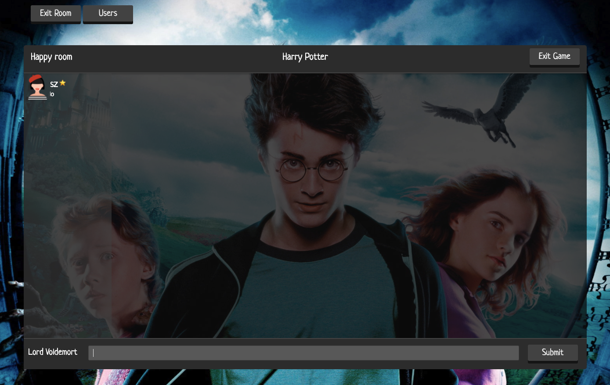
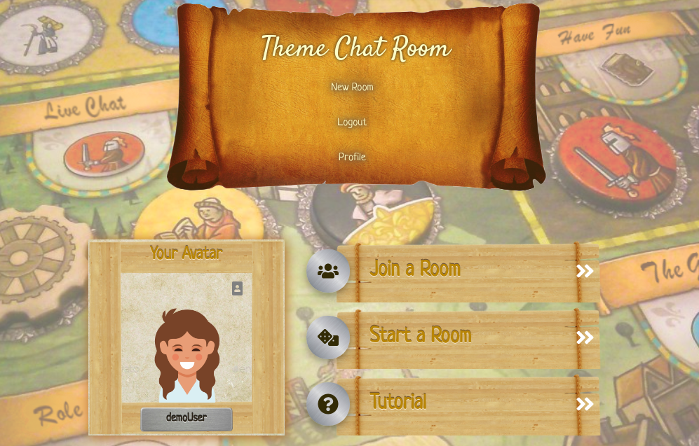

# Theme Chat Room

[Theme Chat Room live](https://thegameroom100.herokuapp.com/#/)

During the COVID-19 quarantine it is important to have the ability to play board/card games remotely. Our App provides channels/game rooms for users to play their favorite role playing games with live chat. Our App is a minimal viable product that tackles the following challenges:

* Live Chat: Real time communication that feel instantaneous.  
* User can have freedom to chat with their friends and random users within game mode on the app.  
* Gives users the tools to create games with their friends. Custom card creation allows players personalize their game room and playing experience.   

OurApp is primarily built with the MERN stack, a combination of following four technologies: MongoDB, Express, React, and Node.



# Functionality & MVP

* User authorization: 
   * sign up and log in
   * each user can only join one game room at one time
* Live chat functionality 
  * can support multi rooms realize live chat functionality
* Game room
   * the game room is based on a live chat window
   * can toggle to display users list
   * A player can create game rooms that other players can join via a link
   * New players cannot join a game room after the game starts 
   * Creator of the game room will be the admin to submit which theme/name cards to use for the game. If the admin leaves the game, this role will be randomly assigned to another player
* Role play game mode
   * After the game starts, the game room name will be set to the theme of the game and each player's username will be set to his/her name card
   * The admin can choose a theme and the name cards from pre-set options, or create customized ones  
   * The name cards will be randomly distributed to each player. 
   * Still stay in game mode after hard refresh.
   
## Technologies & Technical Challenges
The main challenge of this website will be to facilitate fast and efficient communication between players across multiple different game rooms simultaneously. This is achieved using socket.io which will allow for two-way communication between the user's browser and the server. Another challenge is to share the role-distribution information to each user in the same room, as well as to update the information on time when there's user come in/out of the room. This is realized by combining the React's lifecycle methods and Socket.io  

Socket interactions that handle entering and exiting a room.
```js
socket.on('join-room', roomData => {
  socket.join(roomData.room_id, () => {
    Room.findById(roomData.room_id)
    .then(room => {
      if (roomData.user_id) {
          if (!(room.users.includes(roomData.user_id)) ) 
          {
              room.users.push(roomData.user_id)
          }
      }
      room.save()
      .then(()=>socket.to(roomData.room_id).emit('update-room-info', roomData))

    })
  })

  Message.find({room_id:roomData.room_id}).sort({date: -1}).limit(20).exec((err, messages) => {
  if (err) return console.error(err);    
  // Send the last messages to the user.
  socket.emit('init', messages);

  });
})
socket.on('disconnect', ()=> {
  console.log('user disconnected')
})

socket.on('exit-room', (roomData) => {
  socket.leave(roomData.room_id, () => {

    console.log(`a user left ${roomData.room_id}`)
    Room.findById(roomData.room_id)
    .then(room => {
      if (room.id === '5e973d51f2632f0ada4f6860' && roomData.user_id === '5e725fb8952bd9184885a349') return 

      if (room.users.includes(roomData.user_id) ) 
      {
        const idx = room.users.indexOf(roomData.user_id)
        room.users = room.users.slice(0, idx).concat(room.users.slice(idx+1))
      }
      room.save().then(() => socket.to(roomData.room_id).emit('update-room-info', roomData))
    })
  })

})
```

### Backend: Node, Express, MongoDB
The backend will be responsible for keeping track of and storing game rooms, users, roles. Technical challenges include managing admin privileges in rooms, when to save and fetch the role-distribution information, and when to update the state of a room(in game or not in game).

Backend solution to generating a theme and distributing roles appropriately.

```js
socket.on('createtheme', (themeData) => {
  Room.findById(themeData.room_id).then(room =>
    {
    let roleDis = {}
    let roles = Object.values(themeData.roles)

    room.users.forEach(user_id => {
      const idx =  Math.floor(Math.random() * (Object.keys(roles.length).length ))
      roleDis[user_id] = {name:roles[idx],
        role_avator_id :Math.floor(Math.random() * 10)}
      roles = roles.slice(0, idx).concat(roles.slice(idx+1))
    }) 
    const roleDisRes = new RoleDistribution({
      distribution:roleDis,
      room_id: room._id,
      theme:themeData.theme,
    })
    roleDisRes.save()
    .then(()=>{
      room.game = themeData.theme
      return room.save()
    })
    .then((room)=>{
      let gamemode = {
      room_id: themeData.room_id,
      mode: themeData.theme
    }
    io.in(themeData.room_id).emit('modeon', gamemode)
    })

  })
})
```

### Frontend: React/Node.js 
The frontend will need to update the page every time a new message is typed into chat. It will also need to display all relevant information to the user and update that data in real time. Such as when another user leaves the room, the room state changes, or when the game starts/ends.

Initialization of room to show previous messages in CompoenentDidMount
```js
this.socket.on('init', (msgs) => {     
    const chatmsgsId = this.state.chat.map(msg => msg._id)
    const filteredmsgs = msgs.filter(message=> message.room_id === this.props.room._id && !chatmsgsId.includes(message._id))

    // get list of unique user ids from messages and fetch from database
    const usersSet = {}
    for (let m of filteredmsgs) {
      usersSet[m.user_id] = true;
    }
    for (let id of Object.keys(usersSet)) {
      if (this.props.users[id] === undefined) this.props.fetchUser(id)
    }
    const botId = "5f4cc6034a733d238096d446";
    if (this.props.users[botId] === undefined) this.props.fetchUser(botId)

    this.setState((state) => ({
      chat: [...state.chat, ...filteredmsgs.reverse()],
      admin: this.props.room.users[0] === this.props.curr_user.id
    }), this.scrollToBottom);
  });  
```

Method to handle submission of a message from the frontend
```js
if (this.state.content){
this.setState((state) => {

const message = {
  user_id: this.props.curr_user.id,
  content: state.content,
  room_id: this.props.room._id
}

this.socket.emit('message', message);
```

### Livechat
The application used socket.io to implement livechat. Challenges include figuring out how to incorporate socket.io with the mongo db backend.

Backend code to handle messaging:
```js
socket.on('message', (msg) => {
  //Create a message with the content and the name of the user.
  const message = new Message({
    content: msg.content,
    user_id: msg.user_id,
    room_id: msg.room_id
  });
  // Save the message to the database.
  message.save((err) => {
    if (err) return console.error(err);
  });
  // Notify all other users about a new message.
  socket.to(msg.room_id).emit('push', msg);
});
```

### UI/UX
The user interface will need to fit all data pertaining to the room a user belongs to: including their role, the admin, what state the game is in, and a list of other users in the room along with their messages. The challenge will be to find ways to fit all this information on the page and still have it be easily readable and intuitive for the user viewing the page.

Home page view when a user is logged in uses custom images, textures, and readable fonts to create a more unique user experience.



# Group Members 
**Jonathan Odom, Rakin Rouf, Skylar Zhu, Songge Sun**
